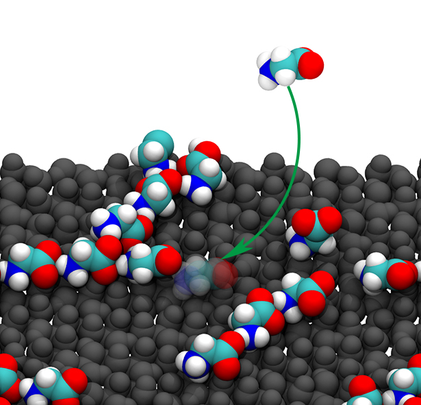

# GLY_Alumina

[//]: <> (figs)

https://github.com/user-attachments/assets/5683db00-0abe-4790-b1ba-a92c1a278180

The zip file contains essential files to run metadynamics simulations of Glycine adsorption on the alumina/water interfaces.

Software: GROMACS-2016.3, PLUMED-2.3.2

#### To read the paper, please visit:
Preprint: [https://doi.org/10.26434/chemrxiv-2024-qjq83](https://doi.org/10.26434/chemrxiv-2024-qjq83)

Publication: 

